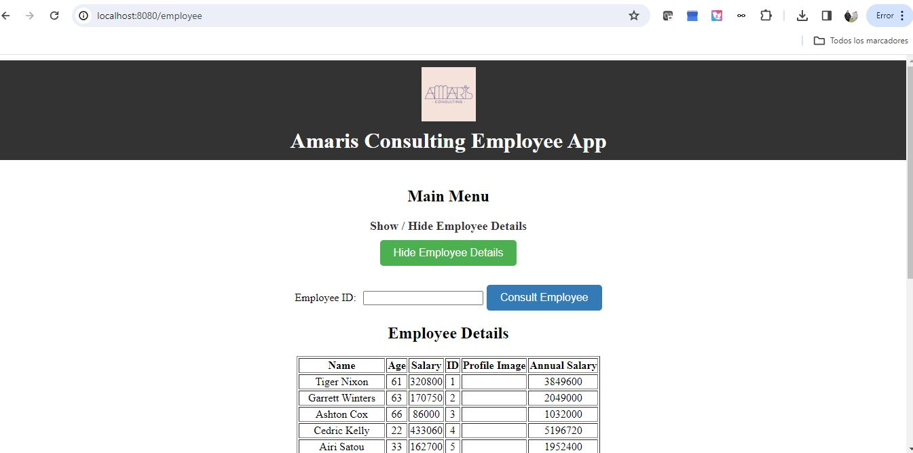
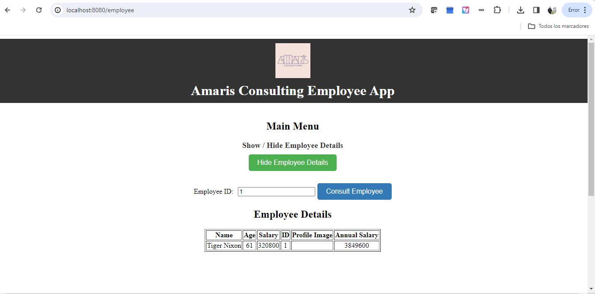
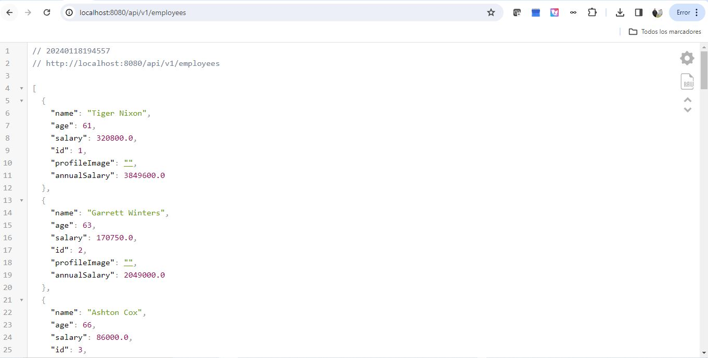
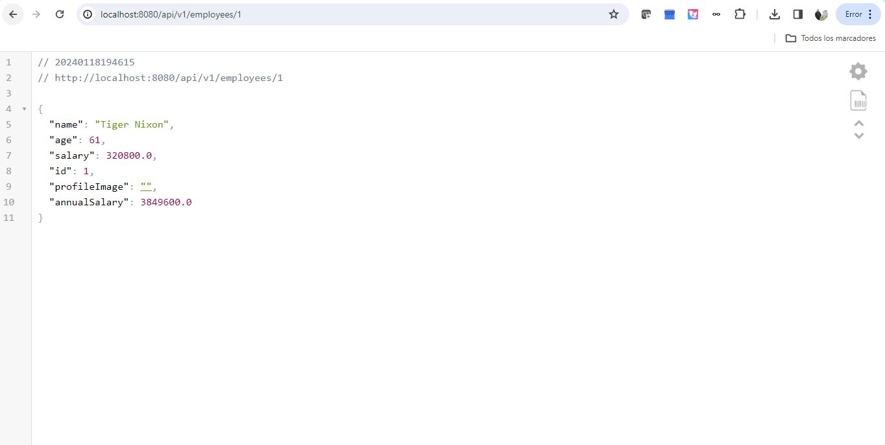

# Amaris Consulting Employee Management App

Welcome to the Employee Management App! This application allows you to manage and query employee data through a user-friendly interface. 
This project was developed as part of a technical assessment for Amaris Consulting.

## Prerequisites

Before running the app, ensure that you have the following software installed:

1. **Gradle**: Minimum version **6.8.3**
2. **Java**: Version **1.8+**
3. **Node**: Version **18**
4. **npm**: Version **9**

## Getting Started

Follow these steps to run the application:

1. Navigate to the 'employee' folder:

    ```bash
    cd employee
    ```

2. Run the following command to start the application:

    ```bash
    ./gradlew bootRun
    ```

3. Open your web browser and go to [localhost:8080](http://localhost:8080) to access the app.

   
   

## API Endpoints

- To query all employees: [localhost:8080/api/v1/employees](http://localhost:8080/api/v1/employees)
  
- To query a specific employee: [localhost:8080/api/v1/employee/{id}](http://localhost:8080/api/v1/employee/{id})
  
  
## Contributing

- **Nicolás Aguilera Contreras**
  - Linkedln: [Your GitHub Profile](https://www.linkedin.com/in/nicol%C3%A1s-aguilera-contreras-3137a01b2?originalSubdomain=co)

## License

This project is licensed under the MIT License - see the [LICENSE](LICENSE) file for details.
